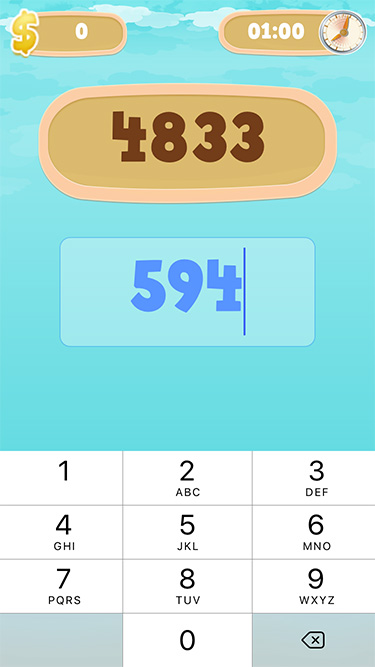

# "Add 1"

"Add 1" is a very simple game for iPhone in which the player needs to add one to a string of random numbers

## Getting Started

"Add 1" is part of a code guide series on [LearnAppMaking.com](https://learnappmaking.com).

- [Creating A Simple iOS Game With Swift in Xcode (Part 1)](https://learnappmaking.com/add-1-creating-a-simple-ios-game-with-swift-in-xcode-week-1/)
- [Creating A Simple iOS Game With Swift in Xcode (Part 2)](https://learnappmaking.com/add-1-creating-a-simple-ios-game-with-swift-in-xcode-week-1/)
- [Creating A Simple iOS Game With Swift in Xcode (Part 3)](https://learnappmaking.com/add-1-creating-a-simple-ios-game-with-swift-in-xcode-week-1/)

### Running

Running this project is easy – simply download the project, open it in Xcode 8+ and hit _Cmd-R_.

_Updated for Swift 3_

